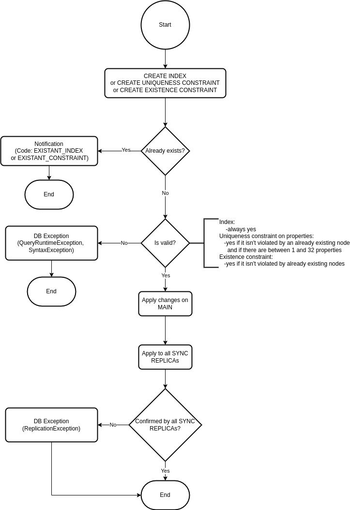
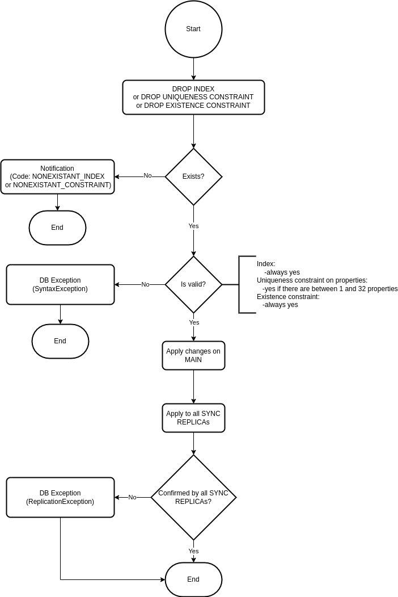
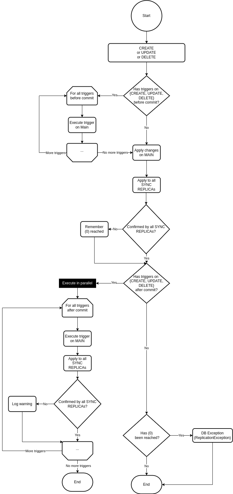

Uninterrupted data and operational availability in production systems are
critical and can be achieved in many ways. In Memgraph we opted for replication.

In distributed systems theory the CAP theorem, also named Brewer's theorem,
states that any distributed system can simultaneously guarantee two out of the
three properties:

1. **Consistency** - every node has the same view of data at a given point in
   time
2. **Availability** - all clients can find a replica of the data, even in the
   case of a partial node failure
3. **Partition tolerance** - the system continues to work as expected despite a
   partial network failure

Most of the Memgraph use-cases do not benefit from well-known algorithms that
strive to achieve all three CAP properties, such as Raft, because due to their
complexity they produce performance issues. Memgraph use-cases are based on
running analytical graph workloads on real-time data, demanding a simpler
concept such as **replication**.

Replication consists of replicating data from one storage to one or several
other storages. The downside of its simplicity is that only two out of three CAP
properties can be achieved.

## Replication implementation in Memgraph

To enable replication, there must be at least two instances of Memgraph in a
cluster. Each instance has one of two roles: MAIN or REPLICA. The MAIN instance
accepts read and write queries to the database and REPLICA instances accept only
read queries.

The changes or state of the MAIN instance are replicated to the REPLICA
instances in a SYNC or ASYNC mode.

By using the timestamp, the MAIN instance knows the current state of the
REPLICA. If the REPLICA is not synchronized with the MAIN instance, the MAIN
instance sends the correct data for synchronization as WAL files.

If the REPLICA is so far behind the MAIN instance that the synchronization using
WAL files is impossible, Memgraph will use snapshots.

## Replication modes

:::info

From version 2.4 it is no longer possible to specify a timeout when registering
a sync replica. To mimic this behavior in higher releases, please use ASYNC
replication instead.

:::

Replication mode defines the terms by which the MAIN instance can commit the
changes to the database, thus modifying the system to prioritize either
consistency or availability. There are two possible replication modes
implemented in Memgraph replication:

- SYNC
- ASYNC

When a REPLICA instance is registered and added to the cluster, it will start
replicating in ASYNC mode. That will allow it to catch up to the current state
of the MAIN instance. When the REPLICA instance synchronizes with the MAIN
instance, the replication mode will change according to the mode defined during
registration.

### SYNC replication mode

SYNC mode is the most straightforward replication mode in which the main storage
thread waits for the response and cannot continue until the response is
received or until a timeout is reached. If the timeout is reached and at least one SYNC REPLICA has not
sent back a response, then the MAIN instance will then return an error to the user. 
The error indicates to the user that he should check the status of the REPLICAS
as there might be a network/hardware issue.

The following diagrams express the behavior in case a SYNC REPLICA would not answer within the expected timeout.

#### SYNC REPLICA going down when creating index, uniqueness constraint or existence constraint

#### SYNC REPLICA going down when dropping index, uniqueness constraint or existence constraint

#### SYNC REPLICA going down adding/updating/deleting data

### ASYN replication mode

In the ASYNC replication mode, the MAIN instance will commit a transaction
without receiving confirmation from REPLICA instances that they have received
the same transaction. This means that the MAIN instance does not wait for the
response from the REPLICA instances in the main thread but in some other thread.

A new thread can be created every time a transaction needs to be replicated to
the REPLICA instance, but because transactions are committed often and use a lot
of resources, each REPLICA instance has one permanent thread connecting it with
the MAIN instance. Using this background thread, the MAIN instance pushes
replication tasks to the REPLICA instance, creates a custom thread pool pattern,
and receives confirmations of successful replication from the REPLICATION
instance.

ASYNC mode ensures system availability and partition tolerance.

## Synchronizing instances

By comparing timestamps, the MAIN instance knows when a REPLICA instance is not
synchronized and is missing some earlier transactions. The REPLICA instance is
then set into a RECOVERY state, where it remains until it is fully synchronized
with the MAIN instance.

The missing data changes can be sent as snapshots or WAL files. Snapshot files
represent an image of the current state of the database and are much larger than
the WAL files, which only contain the changes, deltas. Because of the difference
in file size, Memgraph favors the WAL files.

While the REPLICA instance is in the RECOVERY state, the MAIN instance
calculates the optimal synchronization path based on the REPLICA instance's
timestamp and the current state of the durability files while keeping the
overall size of the files necessary for synchronization to a minimum.

Imagine there were 5 changes made to the database. Each change is saved in a WAL
file, so there are 5 WAL files, and the snapshot was created after 2 changes.
The REPLICA instance can be synchronized using a snapshot and the 3 latest WAL
files or using 5 WAL files. Both options would correctly synchronize the
instances, but 5 WAL files are much smaller.

The durability files are constantly being created, deleted, and updated. Also,
each replica could need a different set of files to sync. There are several ways
to ensure that the necessary files persist and that instances can read the WAL
files currently being updated without affecting the performance of the rest of
the database.

### Locking durability files

Durability files are also used for recovery and are periodically deleted to
eliminate redundant data. The problem is that they can be deleted while they are
being used to synchronize a REPLICA with the MAIN instance.

To delay the file deletion, Memgraph uses a file retainer that consists of
multiple lockers. Threads can store and lock the files they found while
searching for the optimal recovery path in the lockers, thus ensuring the files
will still exist once they are sent to the REPLICA instance as a part of the
synchronization process. If some other part of the system sends a deletion
request for a certain file, the file retainer first checks if that file is
locked in a locker. If it is not, it is deleted immediately. If the file is
locked, the file retainer adds the file to the deletion queue. The file retainer
will periodically clean the queue by deleting the files that are no longer
locked inside the locker.

### Writing and reading files simultaneously

Memgraph internal file buffer is used when writing deltas to WAL files, and
mid-writing, the content of one WAL file can be divided across two locations. If
at that point that WAL file is used to synchronize the REPLICA instance, once
the data is being read from the internal buffer, the buffer can be flushed, and
the REPLICA could receive an invalid WAL file because it is missing a chunk of
data. It could also happen that the WAL file is sent before all the transactions
are written to the internal buffer.

To avoid these issues, flushing of that internal buffer is disabled while the
current WAL is sent to a REPLICA instance. To get all the data necessary for the
synchronization, the replication thread reads the content directly from the WAL
file, then reads how many bytes are written in the buffer and copies the data to
another location. Then the flushing is enabled again, and the transaction is
replicated using the copied buffer. Because the access to the internal buffer
was not blocked, new data can be written. The content of the buffer (including
any new data) is then written in a new WAL file that will be sent in the next
synchronization process.

### Fixing timestamp consistency

Timestamps are used to compare the state of the REPLICA instance in comparison
to the MAIN instance.

At first, we used the current timestamp without increasing its value for global
operations, like creating an index or creating a constraint. By using a single
timestamp, it was impossible to know which operations the REPLICA had applied
because sequential global operations had the same timestamp. To avoid this
issue, a unique timestamp is assigned to each global operation

As replicas allow read queries, each of those queries was assigned with its own
timestamp. Those timestamps caused issues when the replicated write transactions
were assigned an older timestamp. A read transaction would return different data
from the same read query if a transaction was replicated between those two read
transactions which obstructed the snapshot isolation. To avoid this problem, the
timestamp on REPLICA instances isn't increased because the read transactions
don't produce any changes, so no deltas need to be timestamped.

### Incompatible instances

To avoid issues when the durability files of two different database instances
are stored in the same folder, a unique ID is assigned to each storage instance.
The same ID is then assigned to the durability files. Replication uses the
instance ID to validate that the files and the database are compatible.

A unique ID `epoch_id` is also assigned each time an instance is run as the MAIN
instance in the replication cluster to check if the data is compatible for
replication. The `epoch_id` is necessary when the original MAIN instance fails,
a REPLICA instance becomes a new MAIN, and after some time, the original MAIN
instance is brought back online. If no transactions were run on the original
MAIN instance, the difference in timestamps will indicate that it is behind the
new MAIN, and it would be impossible to set the original MAIN-REPLICA
relationship. But if the transactions were run on the original MAIN after it was
brought back online, the timestamp would be of no help, but the `epoch_id` would
indicate incomparability, thus preventing the original MAIN from reclaiming its
original role.
